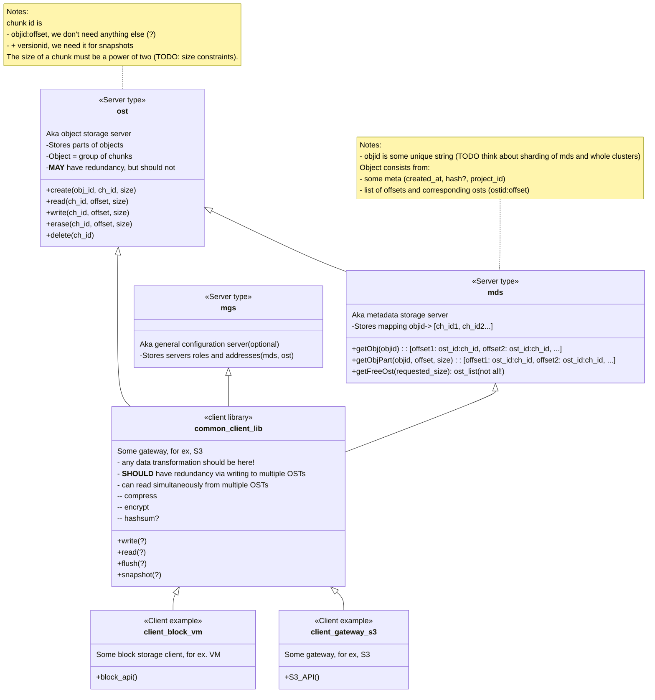

# DRAFT: Rawstor High-level architecture

(Some terms are borrowed from Lustre; an attentive reader may notice some similarities):
- **\*\*T (example - OST) - *T*arget (shard)**
- **\*\*S (example - OSS) - *S*erver (node) with shards of this role**

Components (roles):
- Object storage target (**OST**)
  - directly responsible for storing data (parts of objects)
  - per disk/partition
  - does not handle redundancy
- Metadata storage target (**MDT**)
  - stores mapping "part of object->OST"
  - in the case of block storage, it is largely static, used mainly for initial allocation
- Management server (**MGS**) (optional)
  - entry point with basic information about SDS (lists of MDS/OSS and so on)
- Client library
  - a library implementing a basic client for SDS
  - higher-level "facades" should be built on top of it, such as the QEMU driver, S3 gateway, and so on
  - what distinguishes rawstor from other solutions is that the responsibility for redundancy and data preparation lies expicitly **on the client**
  - if service operations in SDS (such as recovering redundancy when a server/disk fails) are needed, such logic should be based on the client library with one difference being that it can be run in another mode closer to the data

Entity - object:
- has various properties
  - example - replication factor
- can be sliced across different OSTs (aka Chunks)
  - **IMPORTANT**: key difference of rawstor from other solutions is that you can deside how your data will be slided across OSTs (Chunk size, distribution strategy, etc.)
    - from "local" storage (one whole volume on one OST only as one `chunk`)
    - to "distributed" storage (like `CEPH` - small chunks distributed across whole cluster, although this strategy is a little bit discouraged in Rawstor, we already have Ceph, Vitastor and other Ceph-like storages)
    - best way to look at Rawstor as a "middle ground" between local and distributed storage (DRBD with massive slicing and feature-rich client, or shared-nothing Lustre with redundancy out of the box)
- must have two modes
  - mutable: needed for fast block storage
  - immutable: convenient for object storage
