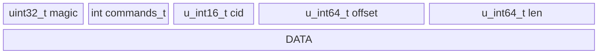
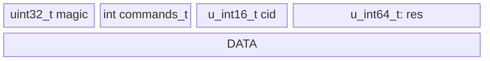

# DRAFT: Rawstor Protocol design

- TCP stateful connection
- Any request will have response frame before actual data transition (see `proto_resp_frame_t`)
- Magic number for protocol frames is `0x72737472 // "rstr" as ascii` (used for consistency and endianness checks)

#### commands:
(see `commands_t` enum)
- CMD_SET_OBJECT
- CMD_READ
- CMD_WRITE
- CMD_DISCARD
- TDB, other commands are not defined yet.

#### Auth + initialization
- First request via connection should be `CMD_SET_OBJECT` command (see `proto_basic_frame_t` struct)
- TBD: Authentication mechanism, cababilities negotiation, etc.

#### IO requests
- See `proto_io_frame_t` struct
- `cid` - command ID, used to correlate request and response if many requests issued simultaneously
- after this request frame, data follows if any (for write requests)

#### IO requests
- See `proto_resp_frame_t` struct
- `cid` - command ID, used to correlate request and response if many requests issued simultaneously
- `res` - response code, if positive, request was successful (bytes written/read, etc.), negative - error code
- after this response frame, data follows if any (for read requests)

